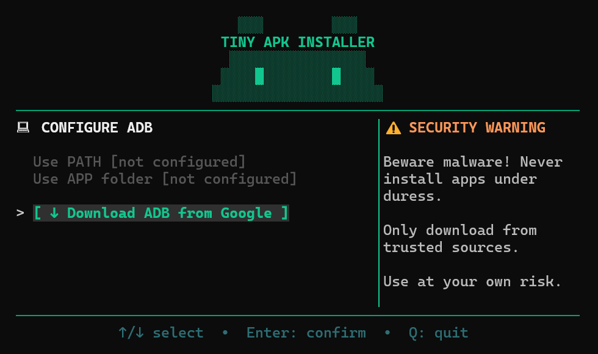

# Tiny APK Installer

A simple terminal UI (TUI) application to take the hassle out of installing APKs and bunldes on Android devices via ADB.
Tiny APK does not include ADB, it can plug into an existing PATH or can download ADB for you from Google.



<a href='https://ko-fi.com/T6T11HTIG3' target='_blank'>
  
</a>

This project was built with the assistance of AI, specifically MiniMax M2.7.

## Features

- **Device Discovery** - Automatically detects USB and wireless Android devices
- **Wireless Pairing** - Pair and connect to devices over WiFi using pairing code
- **APK Installation** - Install single APKs, split APKs, or app bundles with OBB data
- **File Browser** - Browse and select APK files directly from the terminal
- **Auto ADB** - Downloads ADB directly from Google if you don't have it
- **Cross-Platform** - Works on Windows, macOS, and Linux

## Requirements

- [Go 1.21+](https://go.dev/dl/) to build from source
- [Android Debug Bridge](https://developer.android.com/tools/adb) to connect Android devices

## Building

### Windows

```powershell
# Build for current platform
.\build.ps1

# Build for all platforms
.\build.ps1 -All
```

### macOS / Linux / Unix

```bash
# Build for current platform
./build.sh

# Build for all platforms
./build.sh --all
```

### Manual Build

```bash
go build -ldflags="-s -w" -o tiny-apk-installer.exe .
```

## Usage

1. Launch the application
2. If ADB is not found, select an option:
   - **Use PATH** - If adb is in your system PATH
   - **Use APP** - Use adb downloaded to the app's data folder
   - **Download** - Auto-download ADB platform-tools to the app's data folder
3. Navigate tabs with **Left/Right arrows**
4. Select a device to install to
5. Browse and select an APK file
6. Press **Enter** to install

### Keyboard Shortcuts

| Key | Action |
|-----|--------|
| `←` / `→` | Navigate tabs |
| `Enter` | Install APK / Confirm |
| `B` | Browse for APK file |
| `↑` / `↓` | Scroll / Select |
| `Esc` | Cancel / Go back |
| `Q` | Quit |

## License

Android Debug Bridge is licensed under [Apache 2.0](https://developer.android.com/license)

Tiny APK Installer is licensed under [MIT](LICENSE)
